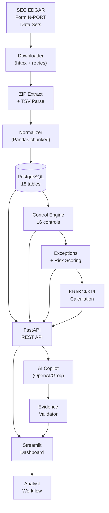

# 🛡️ AWM ControlWatch

**Investment Operations Risk & Control Monitoring Platform**

> ⚠️ **Disclaimer:** This is an educational/research implementation based on publicly available SEC data. It does not replicate or represent Goldman Sachs' proprietary systems, controls, data, or risk framework.

[](https://github.com/your-repo/awm-controlwatch/actions)
[](https://www.python.org/downloads/)
[](https://opensource.org/licenses/MIT)

---

## Overview

AWM ControlWatch is a full-stack investment operations risk and control monitoring platform that demonstrates concepts relevant to an Asset & Wealth Management Monitoring & Testing function. It ingests publicly available SEC Form N-PORT data, runs deterministic operational controls, calculates risk indicators, manages exceptions, and provides AI-assisted analysis — all through a professional Streamlit dashboard.

### What It Does

```
SEC N-PORT Public Data
    ↓
Investment Fund Portfolio Analysis
    ↓
Data Quality Controls (4 controls)
    ↓
Reconciliation Controls (2 controls)
    ↓
Valuation Controls (2 controls)
    ↓
Concentration Risk Controls (4 controls)
    ↓
Liquidity & Reporting Controls (3 controls)
    ↓
Classification Controls (1 control)
    ↓
Risk Scoring (deterministic, explainable)
    ↓
KRI / KCI / KPI Monitoring
    ↓
Exception Management & Remediation
    ↓
Audit Trail
    ↓
Management Reporting Dashboard
    ↓
GenAI-Assisted Analysis (optional)
```

### Key Capabilities

| Capability | Description |
|------------|-------------|
| **Data Ingestion** | Automated SEC N-PORT bulk data pipeline with chunked processing |
| **16 Deterministic Controls** | Data quality, reconciliation, valuation, concentration, liquidity, reporting, classification |
| **Risk Scoring Engine** | Transparent, explainable risk scoring with inherent/residual risk calculation |
| **KRI Framework** | 7 Key Risk Indicators with RAG status and trend analysis |
| **KCI Framework** | 7 Key Control Indicators monitoring control health |
| **KPI Framework** | 8 operational performance metrics |
| **Exception Management** | Full lifecycle: Detection → Triage → Investigation → Remediation → Validation → Closure |
| **Remediation Tracking** | Owner assignment, due dates, MTTR, overdue monitoring |
| **Audit Trail** | Every state change logged with actor, timestamp, old/new values |
| **AI Copilot** | Optional GenAI analysis (OpenAI/Groq) with evidence validation |
| **REST API** | 15+ endpoints with OpenAPI documentation |
| **Dashboard** | 8-page professional Streamlit dashboard |

---

## 🔬 Real SEC N-PORT Full-Quarter Validation & Benchmarks

The platform has been validated end-to-end against the complete population of the official SEC DERA Form N-PORT bulk dataset (`2025q3_nport.zip`):

### 1. Ingestion Integrity & Scale
- **Official Dataset:** Form N-PORT Q3 2025 (468.9 MB ZIP, SHA-256: `4cc5c2431bf8997ef0af1cb7b69568255a1d6a1840e41499d9ffd1fc42e030f6`)
- **Entities Loaded:** 13,199 submissions, 1,940 registrants, 13,103 fund series, 13,199 fund instances, **6,025,567 holdings** (2,291,229 active for reporting period `2025-06-30`)
- **Fund ↔ Holding Coverage:** **99.95%** (6,597 of 6,600 active reporting funds have complete holdings schedules)
- **Streaming Ingestion Throughput:** **34,284 rows/sec** (6,025,567 holdings loaded in 175.75s via PostgreSQL binary COPY protocol with 89.08 MB peak process RAM)
- **Relational Integrity:** **0 orphan records**, **0 foreign key violations**, **0 duplicate holdings** on natural keys

### 2. Control Execution Benchmarks (Full Population)
All 16 deterministic controls executed across **27,088,382 record evaluations** in **13.29 seconds aggregate runtime**:
- **Portfolio Completeness (`REC-002`):** Validated across 6,597 testable funds with a **90.34% pass rate** (5,960 funds matching within 10% analytical tolerance; Vanguard Total Stock Market Index Fund matched within 0.18% across $1.915T in assets).
- **High-Fidelity Anomaly Detection:** Detected Russian telecom ADR (`MOBILNYE TELESISTEMY PAO`) marked to $0 under sanctions in `VAL-001`; short positions in `DQ-003`; concentrated portfolios in `CONC-001`; and delayed filings in `RPT-001`.
- **Taxonomy Classification:** Strict separation into **3,295 Analytical Exceptions**, **1,540 Data Quality Exceptions**, and **2,558 Data Availability Items** (mapped to `INSUFFICIENT_EVIDENCE` risk status).

### 3. Risk & Control Metrics
- **7 Key Risk Indicators (KRIs):** Concentration Exposure (`RED`), Reconciliation Exception Rate (`9.70%` [AMBER]), Data Quality Exception Rate (`0.0168%` [GREEN]), Valuation Anomaly Rate (`0.0067%` [GREEN]), Reporting Timeliness (`56.07 days` [AMBER]), Exception Aging (`0.00 days` [GREEN]), Repeat Exception Rate (`0.00%` [GREEN]).
- **7 Key Control Indicators (KCIs):** Control Execution Rate (`100.0%`), Evidence Completeness (`100.0%`), Control Coverage (`100.0%`).
- **8 Operational KPIs:** 6,600 funds processed, 2,291,229 period holdings, 6,096,562 total records, 100% automation coverage.

### 4. Lifecycle, Governance & Safety
- **Exception State Progression:** Verified live transition `DETECTED` → `TRIAGED` → `ASSIGNED` → `INVESTIGATING` → `REMEDIATION_PLANNED` → `REMEDIATION_IN_PROGRESS` → `VALIDATION` → `CLOSED` with immutable audit trail.
- **AI Safety & Missing Evidence Refusal:** 100% pass rate on prompt-injection defenses; explicit refusal string output when filing evidence is missing (`"There is insufficient evidence in the reported filings to determine whether this represents a genuine control breach."`).
- **Test Suite:** **96 automated tests passing with 100% pass rate in 0.32 seconds**.

Detailed verification reports:
- [Final Production Validation Report](reports/FINAL_VALIDATION_REPORT.md)
- [Control Execution Full Data Report](reports/control_execution_full_data.md)
- [Exception Integrity & Sample Artifact Analysis](reports/exception_integrity_analysis.md)
- [Fund Coverage Analysis Report](reports/fund_holdings_coverage_analysis.json)

---

## Architecture



### Tech Stack

| Layer | Technology |
|-------|-----------|
| Backend | Python 3.12+, FastAPI |
| Database | PostgreSQL 16 |
| Analytics | Pandas, NumPy, SQL |
| Dashboard | Streamlit, Plotly |
| AI | OpenAI API / Groq API (optional) |
| Testing | pytest (45+ tests) |
| Infrastructure | Docker, Docker Compose |
| CI | GitHub Actions |

---

## Data Source

### SEC Form N-PORT Data Sets

**Official Source:** [SEC DERA Data Library — Form N-PORT](https://www.sec.gov/data-research/sec-markets-data/form-n-port-data-sets)

Form N-PORT is a monthly reporting form for registered investment companies (mutual funds, ETFs) filed with the SEC. The SEC publishes quarterly bulk datasets containing structured data from these filings.

**What's in the data:**
- Fund information (name, registrant, CIK, total assets, net assets)
- Individual holdings (security name, CUSIP, ISIN, quantity, value, % of NAV)
- Security classifications (asset category, issuer type, country)
- Filing metadata (accession number, filing date, reporting period)

**URL Pattern:** `https://www.sec.gov/files/dera/data/form-n-port-data-sets/{year}q{quarter}_nport.zip`

**Available Data:** October 2019 through June 2026 (quarterly updates)

**Default Development Dataset:** 2025 Q3

> The SEC ZIP files contain TSV (tab-separated) files: `SUBMISSION.tsv`, `FUND_REPORTED_INFO.tsv`, `FUND_REPORTED_HOLDING.tsv`, and others. The pipeline parses these automatically.

---

## Quick Start

### Option 1: Docker Compose (Recommended)

```bash
# Clone the repository
git clone https://github.com/your-repo/awm-controlwatch.git
cd awm-controlwatch

# Copy environment configuration
cp .env.example .env

# Start all services
docker-compose up -d

# Run bootstrap (sample mode for quick start)
docker-compose exec backend python scripts/bootstrap.py --sample

# Access the application
# Dashboard: http://localhost:8501
# API Docs:  http://localhost:8000/docs
# API:       http://localhost:8000/health
```

### Option 2: Local Development

```bash
# Prerequisites: Python 3.12+, PostgreSQL 16+

# Create virtual environment
python -m venv venv
source venv/bin/activate

# Install dependencies
pip install -r requirements.txt

# Configure environment
cp .env.example .env
# Edit .env with your PostgreSQL credentials

# Initialize and run
python scripts/bootstrap.py --sample

# Start API
uvicorn backend.main:app --reload

# Start Dashboard (separate terminal)
streamlit run dashboard/app.py
```

### Full Dataset Ingestion

```bash
# Ingest a specific quarter (downloads ~200-400MB)
python scripts/bootstrap.py --quarter 2025q3

# Or just run ingestion
python scripts/ingest.py --quarter 2025q3

# Sample mode for development (first 5000 holdings)
python scripts/bootstrap.py --sample --sample-size 5000
```

---

## Control Framework

### 16 Implemented Controls

| ID | Control | Risk Category | Description |
|----|---------|--------------|-------------|
| DQ-001 | Missing Required Fields | Data Quality | Detects NULL critical fields in holdings |
| DQ-002 | Duplicate Holdings | Data Quality | Detects duplicate holdings on natural keys |
| DQ-003 | Invalid Values | Data Quality | Detects impossible/invalid numeric values |
| DQ-004 | Classification Consistency | Data Quality | Checks classification completeness |
| REC-001 | Period Reconciliation | Reconciliation | Compares holdings T vs T-1 |
| REC-002 | Portfolio Completeness | Reconciliation | Verifies holdings sum vs fund total |
| VAL-001 | Stale/Zero Prices | Valuation | Detects stale or zero implied prices |
| VAL-002 | Extreme Price Movements | Valuation | Flags large period-over-period price changes |
| CONC-001 | Position Concentration | Concentration | Top-1/5/10 position % of NAV |
| CONC-002 | Issuer Concentration | Concentration | Issuer-level exposure |
| CONC-003 | Asset Class Concentration | Concentration | Asset category exposure |
| CONC-004 | Geographic Concentration | Concentration | Country-level exposure |
| LIQ-001 | Liquidity Proxy | Liquidity | Holdings-based liquidity classification |
| RPT-001 | Reporting Timeliness | Reporting | Filing delay monitoring |
| RPT-002 | Reporting Gaps | Reporting | Missing period detection |
| CLS-001 | Classification Changes | Data Quality | Period-over-period reclassifications |

> All thresholds are **illustrative analytical thresholds** for educational purposes. See [docs/control_framework.md](docs/control_framework.md) for detailed documentation.

---

## KRI / KCI / KPI Framework

### Key Risk Indicators (KRI) — Risk Exposure

| ID | Indicator | Formula |
|----|-----------|---------|
| KRI-001 | Concentration Exposure | max(top-10 holding %) across funds |
| KRI-002 | Reconciliation Exception Rate | recon exceptions / total reconciliations |
| KRI-003 | Data Quality Exception Rate | DQ exceptions / total records |
| KRI-004 | Valuation Anomaly Rate | valuation exceptions / total holdings |
| KRI-005 | Reporting Timeliness | avg filing delay (days) |
| KRI-006 | Exception Aging | avg age of open exceptions |
| KRI-007 | Repeat Exception Rate | repeat exceptions / total exceptions |

### Key Control Indicators (KCI) — Control Health

| ID | Indicator | Formula |
|----|-----------|---------|
| KCI-001 | Control Execution Rate | executed / scheduled controls |
| KCI-002 | Control Pass Rate | clean executions / total executions |
| KCI-003 | Control Failure Rate | 1 - pass rate |
| KCI-004 | Evidence Completeness | exceptions with evidence / total |
| KCI-005 | Repeat Failure Rate | repeat failures / total failures |
| KCI-006 | Overdue Remediation Rate | overdue / total open |
| KCI-007 | Control Coverage | executed controls / total controls |

### Key Performance Indicators (KPI) — Operational Performance

Funds processed, holdings processed, controls executed, exceptions generated, average processing time, remediation turnaround, automation coverage.

> See [docs/kri_kci_kpi.md](docs/kri_kci_kpi.md) for formulas and methodology.

---

## Risk Scoring

**Formula:** `risk_score = impact × likelihood × (6 - control_effectiveness)`

All components use a 1–5 scale:

| Level | Score Range | Description |
|-------|------------|-------------|
| LOW | 1–24 | Minimal risk, routine monitoring |
| MEDIUM | 25–49 | Moderate risk, enhanced monitoring |
| HIGH | 50–74 | Significant risk, active management |
| CRITICAL | 75–125 | Severe risk, immediate action |

**Inherent vs Residual Risk:**
- Inherent Risk = Impact × Likelihood
- Residual Risk = Inherent Risk × (1 - Control Effectiveness)

> See [docs/risk_taxonomy.md](docs/risk_taxonomy.md) for the complete methodology.

---

## AI Copilot

The optional GenAI copilot provides analytical assistance without replacing deterministic controls.

**Capabilities:**
- Summarize fund control profiles
- Explain KRI/KCI trends
- Suggest root causes for exceptions
- Draft remediation plans
- Summarize management reports

**Safeguards:**
- LLM does NOT determine authoritative risk scores
- Every response grounded in structured evidence
- Post-generation validation checks for hallucination, contradiction, regulatory claims
- Prompt injection defense tested
- Falls back to template responses when no AI provider configured

**Configuration:**
```bash
# In .env
AI_PROVIDER=openai  # or "groq" or "none"
OPENAI_API_KEY=sk-...
# or
GROQ_API_KEY=gsk_...
```

---

## Testing

```bash
# Run full test suite
pytest tests/ -v --cov=backend --cov-report=term-missing

# Run specific categories
pytest tests/unit/ -v              # Unit tests
pytest tests/controls/ -v          # Control logic tests
pytest tests/api/ -v               # API endpoint tests
pytest tests/ai/ -v                # AI validation + prompt injection tests
pytest tests/integration/ -v       # Integration tests
```

**Test Coverage:**
- 45+ automated tests
- Unit tests: risk scoring, thresholds, severity, state machine
- Control tests: DQ, reconciliation, concentration with known data
- API tests: endpoints, pagination, error handling
- AI tests: hallucination, contradiction, prompt injection (5+ injection tests)
- Integration tests: pipeline, normalizer, metrics calculation

---

## API Reference

| Method | Endpoint | Description |
|--------|----------|-------------|
| GET | `/health` | System health check |
| GET | `/funds` | List funds (paginated) |
| GET | `/funds/{id}` | Fund detail |
| GET | `/holdings` | List holdings (paginated, filterable) |
| GET | `/controls` | List control definitions |
| GET | `/controls/{id}` | Control detail with executions |
| GET | `/exceptions` | List exceptions (filterable) |
| GET | `/exceptions/{id}` | Exception detail with evidence |
| POST | `/exceptions/{id}/assign` | Assign exception |
| POST | `/exceptions/{id}/remediate` | Create remediation |
| POST | `/exceptions/{id}/status` | Update status |
| GET | `/kris` | KRI snapshots |
| GET | `/kcis` | KCI snapshots |
| GET | `/kpis` | KPI snapshots |
| GET | `/risk-summary` | Overall risk summary |
| GET | `/audit-events` | Audit trail |
| POST | `/ai/analyze` | AI analysis |
| POST | `/ingestion/run` | Trigger ingestion |

Full OpenAPI docs: `http://localhost:8000/docs`

---

## Dashboard Pages

| Page | Purpose |
|------|---------|
| Executive Overview | KPI cards, risk status, KRI summary, recent exceptions |
| Risk Overview | KRI trends, risk distribution, inherent vs residual |
| Control Monitoring | Control health table, KCI cards, effectiveness trends |
| Exceptions | Filterable exception list with detail, assignment, remediation |
| Remediation | Open/overdue tracking, MTTR, owner workload |
| Fund Analysis | Portfolio composition, concentration, holdings detail |
| AI Analyst | Chat interface, evidence panel, validation status |
| Audit Trail | Complete state change history with diffs |

---

## Investigation Workflow

The platform supports a complete analyst investigation workflow:

1. **Executive Overview** → Spot an AMBER/RED KRI
2. **Risk Overview** → Identify risk category and affected funds
3. **Fund Analysis** → Deep dive into fund portfolio and concentration
4. **Exceptions** → View control exceptions for the fund
5. **Exception Detail** → Inspect evidence and risk score breakdown
6. **Root Cause** → Set root cause category and description
7. **Assign** → Assign to an analyst
8. **Remediation** → Create remediation action with due date
9. **Validation** → Re-run control, validate remediation
10. **Close** → Mark exception as closed
11. **Audit Trail** → Complete history of all state changes

---

## Documentation

| Document | Description |
|----------|-------------|
| [Architecture](docs/architecture.md) | System design and data flow |
| [Control Framework](docs/control_framework.md) | All 16 controls documented |
| [Risk Taxonomy](docs/risk_taxonomy.md) | Risk categories, scoring, residual risk |
| [KRI/KCI/KPI](docs/kri_kci_kpi.md) | Metric definitions and formulas |
| [Testing Strategy](docs/testing_strategy.md) | Test approach and coverage |
| [Data Dictionary](docs/data_dictionary.md) | Database schema and fields |
| [Limitations](docs/limitations.md) | Known limitations and caveats |
| [Methodology](docs/methodology.md) | Analytical methodology |

---

## Limitations

This project has important limitations that should be understood:

- **Public data only** — SEC N-PORT filings are quarterly; no real-time data
- **Derived controls** — Analytical controls, not regulatory requirements
- **No proprietary data** — No access to actual trade data, OMS, or internal risk systems
- **Illustrative thresholds** — All thresholds are for educational demonstration
- **No real pricing** — Valuations are based on N-PORT reported values only
- **Proxy-based liquidity** — Holdings-based classification, not market volume
- **AI is supplementary** — LLM analysis does not replace deterministic controls

See [docs/limitations.md](docs/limitations.md) for the complete list.

---

## Future Improvements

- Real-time EDGAR filing monitoring
- Multi-quarter trend analysis with deeper historical data
- Enhanced liquidity analytics with public market data
- Advanced anomaly detection using statistical methods
- Workflow automation (auto-triage rules)
- Email/Slack alerting for critical exceptions
- Role-based access control with authentication
- Performance optimization for large-scale datasets
- Enhanced data lineage visualization

---

## License

MIT License. See [LICENSE](LICENSE).

---

*Built as an educational/research implementation demonstrating investment operations risk and control monitoring concepts using publicly available SEC data.*
