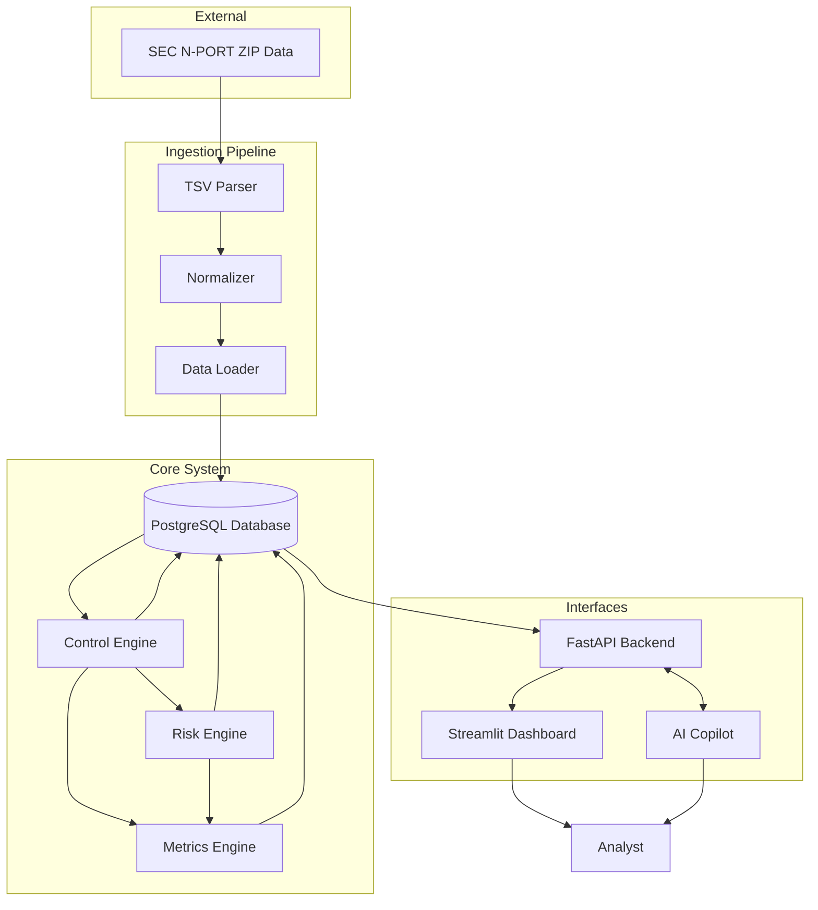

# System Architecture

## Overview

AWM ControlWatch is an educational analytical platform designed to ingest SEC N-PORT data, apply a suite of analytical controls, perform risk monitoring, and visualize the results via a dashboard. The system processes public regulatory data to identify potential anomalies, reconcile data points, and highlight derived analytical findings for review.

*Disclaimer: This is an educational/research implementation. It does not replicate or represent Goldman Sachs proprietary systems, controls, data, or risk framework.*

## Architecture Diagram

## Component Descriptions

- **Ingestion Pipeline**: Downloads and processes SEC N-PORT TSV data, parsing and normalizing it into a relational model.
- **Database (PostgreSQL)**: Stores the normalized N-PORT data, control execution histories, identified exceptions, calculated risk scores, and generated metrics.
- **Control Engine**: Executes predefined, deterministic SQL-based rules (controls) against the SEC data to identify analytical exceptions.
- **Risk Engine**: Calculates inherent and residual risk scores based on exceptions, control effectiveness, and taxonomy.
- **Metrics Engine**: Aggregates exception and risk data into Key Risk Indicators (KRIs), Key Control Indicators (KCIs), and Key Performance Indicators (KPIs).
- **API (FastAPI)**: Exposes endpoints for data retrieval, control execution, and metric reporting.
- **Dashboard (Streamlit)**: Provides a user interface for analysts to view exceptions, metrics, and risk trends.
- **AI Copilot**: An LLM-based assistant that provides supplementary, evidence-grounded analysis of exceptions and risk trends.

## Data Flow

1. **Source**: SEC ZIP files are downloaded containing Form N-PORT data.
2. **Parsing**: Files are parsed from TSV format.
3. **Normalization**: Data is mapped to internal relational schema.
4. **Storage**: Data is loaded into PostgreSQL.
5. **Control Execution**: The Control Engine queries PostgreSQL and flags exceptions.
6. **Risk/Metrics Calculation**: The Risk Engine and Metrics Engine compute KRI/KCI/KPIs based on exceptions.
7. **Visualization**: Streamlit retrieves data via FastAPI and presents it to the Analyst.

## Technology Stack

| Component | Technology | Purpose |
| --- | --- | --- |
| Database | PostgreSQL | Relational data storage |
| ORM / DB Access | SQLAlchemy | Database interactions |
| API | FastAPI | Backend REST API |
| Frontend | Streamlit | Analytical dashboard |
| Processing | Python, Pandas | Data ingestion and manipulation |
| Deployment | Docker Compose | Containerization and orchestration |

## Deployment

The system is designed to be deployed using Docker Compose, orchestrating the database, API, and frontend components as isolated but networked containers.
