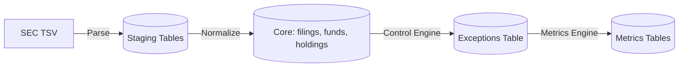

# Data Dictionary

Source Data: **SEC Form N-PORT** datasets (publicly available via SEC DERA).

## Tables

### 1. `filings`
Tracks the overarching N-PORT filing event.
- `accession_number` (VARCHAR, PK): Unique SEC filing identifier.
- `filing_date` (DATE): Date filing was submitted.
- `report_period` (DATE): Period end date for the data.
- `registrant_cik` (VARCHAR): CIK of the entity filing.
- `fund_name` (VARCHAR): Name of the fund.

### 2. `funds`
Details about the specific fund.
- `fund_id` (VARCHAR, PK): Internal or SEC series identifier.
- `accession_number` (VARCHAR, FK -> filings): Link to filing.
- `total_net_assets` (NUMERIC): Reported TNA of the fund.
- `net_asset_value` (NUMERIC): NAV per share.

### 3. `holdings`
Individual portfolio positions within a fund.
- `holding_id` (UUID, PK): Surrogate key.
- `fund_id` (VARCHAR, FK -> funds): Link to fund.
- `name` (VARCHAR): Name of the issuer/asset.
- `identifier_type` (VARCHAR): Type of ID (e.g., CUSIP, LEI).
- `identifier_value` (VARCHAR): The ID string.
- `asset_class` (VARCHAR): Mapped asset class.
- `quantity` (NUMERIC): Number of shares/contracts.
- `value_usd` (NUMERIC): Position value in USD.
- `position_type` (VARCHAR): Long/Short.

### 4. `controls`
Definition of system controls.
- `control_id` (VARCHAR, PK): E.g., 'DQ-001'.
- `name` (VARCHAR): Control name.
- `category` (VARCHAR): Risk category.
- `description` (TEXT): Logic description.

### 5. `control_executions`
Log of when a control was run.
- `execution_id` (UUID, PK): Surrogate key.
- `control_id` (VARCHAR, FK -> controls): Link to control.
- `execution_time` (TIMESTAMP): When it ran.
- `status` (VARCHAR): Success/Failure/Error.
- `records_scanned` (INT): Volume scanned.

### 6. `exceptions`
Anomalies identified by controls.
- `exception_id` (UUID, PK): Surrogate key.
- `execution_id` (UUID, FK -> control_executions): Link to execution log.
- `holding_id` (UUID, FK -> holdings, Nullable): Link to specific holding if applicable.
- `severity` (VARCHAR): LOW, MEDIUM, HIGH, CRITICAL.
- `status` (VARCHAR): Open, Investigating, Closed.
- `description` (TEXT): Details of the break.

*(Note: Additional tables for risk metrics, historical snapshots, and user audit logs follow similar standard relational patterns).*

## Key Join Patterns
- To find all exceptions for a specific fund:
  `exceptions -> control_executions -> controls` joined with `exceptions -> holdings -> funds`.
- To reconcile TNA:
  Sum `value_usd` in `holdings` grouped by `fund_id` and compare to `total_net_assets` in `funds`.

## Data Lineage

