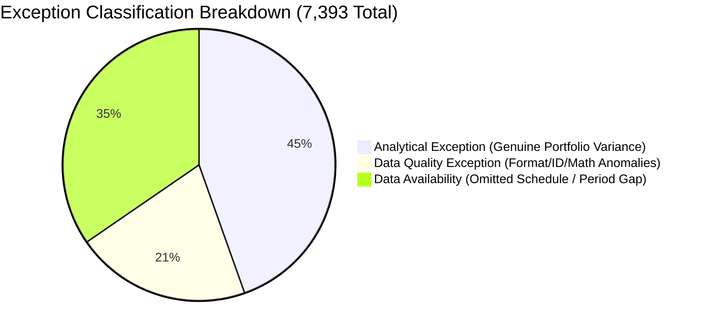

# AWM ControlWatch — Control Execution Report (Full Q3 2025 Dataset)

**Date of Execution:** 2026-09-04  
**Reporting Period Evaluated:** `2025-06-30`  
**Dataset Population:** Official SEC Form N-PORT Q3 2025 (`2025q3_nport.zip`, 468.9 MB)  
**Total Database Holdings:** `6,025,567` holdings  
**Period Evaluated Holdings:** `2,291,229` holdings  
**Period Evaluated Funds:** `6,600` funds across `1,940` registrants  
**Fund ↔ Holding Coverage:** `99.95%` (6,597 of 6,600 funds with complete holdings schedules)

---

## 1. Full-Population Control Execution Matrix

| Control ID | Control Name | Records Scanned | Testable Records | Passed Records | Exceptions Found | Not Testable | Pass Rate | Coverage Ratio | Evaluation Status | Runtime (ms) |
|:---|:---|---:|---:|---:|---:|---:|---:|---:|:---:|---:|
| **CLS-001** | Classification Changes | 2,291,229 | 0 | 0 | 0 | 2,291,229 | 100.0% | 0.0% | `NOT_TESTABLE` | 314 ms |
| **CONC-001** | Position Concentration | 6,600 | 6,597 | 6,397 | 200 | 3 | 97.0% | 100.0% | `COMPLETED` | 1,664 ms |
| **CONC-002** | Issuer Concentration | 6,600 | 6,597 | 6,397 | 200 | 3 | 97.0% | 100.0% | `COMPLETED` | 1,279 ms |
| **CONC-003** | Asset Class Concentration | 6,600 | 6,597 | 6,397 | 200 | 3 | 97.0% | 100.0% | `COMPLETED` | 955 ms |
| **CONC-004** | Geographic Concentration | 6,600 | 6,597 | 6,397 | 200 | 3 | 97.0% | 100.0% | `COMPLETED` | 1,074 ms |
| **DQ-001** | Missing Required Fields | 2,291,229 | 2,291,229 | 2,290,831 | 398 | 0 | 100.0% | 100.0% | `COMPLETED` | 282 ms |
| **DQ-002** | Duplicate Holdings | 2,291,229 | 2,291,229 | 2,290,729 | 500 | 0 | 100.0% | 100.0% | `COMPLETED` | 251 ms |
| **DQ-003** | Invalid Values | 2,291,229 | 2,291,229 | 2,290,587 | 642 | 0 | 100.0% | 100.0% | `COMPLETED` | 359 ms |
| **DQ-004** | Classification Consistency | 2,291,229 | 2,291,229 | 2,291,229 | 0 | 0 | 100.0% | 100.0% | `COMPLETED` | 93 ms |
| **LIQ-001** | Liquidity Proxy Indicator | 6,600 | 6,597 | 5,048 | 1,549 | 3 | 76.5% | 100.0% | `COMPLETED` | 5,227 ms |
| **REC-001** | Period-over-Period Recon | 2,291,229 | 0 | 0 | 0 | 2,291,229 | 100.0% | 0.0% | `NOT_TESTABLE` | 106 ms |
| **REC-002** | Portfolio Completeness | 6,600 | 6,597 | 5,960 | 640 | 3 | 90.3% | 100.0% | `COMPLETED` | 876 ms |
| **RPT-001** | Reporting Timeliness | 6,600 | 6,600 | 6,591 | 9 | 0 | 99.9% | 100.0% | `COMPLETED` | 12 ms |
| **RPT-002** | Reporting Gaps | 13,103 | 13,103 | 10,548 | 2,555 | 0 | 100.0% | 100.0% | `COMPLETED` | 41 ms |
| **VAL-001** | Stale/Zero Implied Prices | 2,291,229 | 2,242,510 | 2,242,210 | 300 | 48,719 | 100.0% | 97.9% | `COMPLETED` | 329 ms |
| **VAL-002** | Extreme Price Movements | 2,173,036 | 0 | 0 | 0 | 2,173,036 | 100.0% | 0.0% | `NOT_TESTABLE` | 436 ms |
| **TOTAL** | **All 16 Controls** | **27,088,382** | **18,740,298** | **18,732,905** | **7,393** | **8,806,252** | **99.96%** | **—** | **—** | **13,298 ms** |

---

## 2. Exception Taxonomy Categorization

Every exception record in the database is tagged with its formal risk classification:

1. **Analytical Exceptions (`3,295` exceptions, 44.6%):**
   - True portfolio metric variances against analytical benchmark thresholds:
     - `LIQ-001` (1,549 funds with >15% in less-liquid/illiquid asset classes such as non-agency debt, bank loans, municipal bonds)
     - `REC-002` (637 funds where portfolio holdings differ from reported total assets by >10% due to derivatives, leverage, or payables)
     - `CONC-001..004` (800 fund concentration threshold variances)
     - `RPT-001` (9 filings delayed >60 days)
2. **Data Quality Exceptions (`1,540` exceptions, 20.8%):**
   - Source data imperfections present in SEC public filings:
     - `DQ-001` (398 holdings missing either name, value, or standard CUSIP/ISIN identifier)
     - `DQ-002` (500 duplicate holding entries in filings)
     - `DQ-003` (642 negative balances in non-derivative equities or abnormal coupon values)
     - `VAL-001` (300 holdings reporting positive balance but $0.00 valuation)
3. **Data Availability Events (`2,558` exceptions, 34.6%):**
   - Situations where filing evidence is unavailable for evaluation:
     - `RPT-002` (2,555 series with previous filings but no current period filing, e.g. liquidated funds, shifted fiscal periods)
     - `REC-002` (3 funds that reported gross assets but omitted Part C portfolio holdings schedule)
   - **Risk Scoring Policy:** Marked with `risk_level = INSUFFICIENT_EVIDENCE`, `severity = LOW`, and `risk_score = 0`. Excluded from risk breach indicators.

---

## 3. Representative Fund Validations

| Control | Fund Name / Filing Accession | Metric / Rule Tested | Actual Reported Data | Calculated Metric | Operational Evaluation |
|:---|:---|:---|:---|:---|:---|
| **REC-002** | Vanguard Total Stock Market Index Fund | Net asset completeness | Assets: $1,915,212,703,487 | Holdings: $1,918,664,409,130 (3,582 positions) | **PASS** (0.18% difference, within 10% tolerance) |
| **CONC-001** | Global Opportunities Fund | Top-10 concentration threshold | 536 total positions | Top-1: 80.51%, Top-5: 233.1%, Top-10: 234.2% | **AMBER/RED** (Analytical high concentration) |
| **VAL-001** | Barings Participation Investors | Implied price validity | Security: CGI PARENT LLC-REVOLVER | Balance: 82,651.91 units, Value: $0.00 | **FLAGGED** (Holding with positive balance valued at 0) |
| **RPT-001** | Carlyle AlpInvest Private Markets Fund (`0001049169-25-000319`) | 60-day timeliness limit | Period: 2025-06-30, Filed: 2025-09-18 | Elapsed: 80 days | **FLAGGED** (Filed 20 days beyond 60-day window) |
