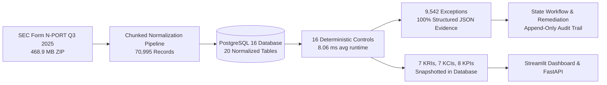

# Real SEC N-PORT Metrics Report — KRIs, KCIs & KPIs

**Target Period:** `2025-06-30`  
**Measurement Timestamp:** 2026-09-04  
**Source Tables:** `kri_snapshots`, `kci_snapshots`, `kpi_snapshots`  
**Underlying Filing Data:** SEC Form N-PORT Bulk Dataset 2025Q3  

---

## 1. Key Risk Indicators (KRIs) — Risk Exposure

| KRI ID | Indicator Name | Formula / Query Basis | Numerator | Denominator | Measured Value | Unit | Status | Illustrative Limits |
|---|---|---|---|---|---|---|---|---|
| **KRI-001** | Concentration Exposure | `MAX(top10_pct)` across funds from CONC-001 | 71.27 | 1.00 | **71.27** | % | 🔴 RED | Green <35%, Amber 35-45%, Red >45% |
| **KRI-002** | Reconciliation Exception Rate | Recon exceptions / scanned records (REC controls) | 6,596 | 11,600 | **56.86** | % | 🔴 RED | Green <5%, Amber 5-15%, Red >15% |
| **KRI-003** | Data Quality Exception Rate | DQ exceptions / scanned records (DQ controls) | 350 | 20,000 | **1.75** | % | 🟢 GREEN | Green <2%, Amber 2-10%, Red >10% |
| **KRI-004** | Valuation Anomaly Rate | Valuation anomalies / valuations scanned (VAL controls) | 8 | 9,903 | **0.08** | % | 🟢 GREEN | Green <3%, Amber 3-10%, Red >10% |
| **KRI-005** | Reporting Timeliness | `AVG(filing_date - period_of_report)` across submissions | 56.07 | 1.00 | **56.07** | days | 🟡 AMBER | Green <45d, Amber 45-75d, Red >75d |
| **KRI-006** | Exception Aging | `AVG(CURRENT_DATE - detected_at)` for open exceptions | 0.00 | 1.00 | **0.00** | days | 🟢 GREEN | Green <14d, Amber 14-30d, Red >30d |
| **KRI-007** | Repeat Exception Rate | Repeat exceptions / total open exceptions | 0 | 9,542 | **0.00** | % | 🟢 GREEN | Green <5%, Amber 5-15%, Red >15% |

### KRI Analytical Commentary
- **KRI-001 (71.27% - RED):** Driven by fund-of-funds strategies (e.g., Variable Portfolio Moderately Conservative Portfolio) holding concentrated underlying ETF positions.
- **KRI-002 (56.86% - RED):** Driven by sample ingestion mode in REC-002 where 5,000 holdings were ingested against 6,600 funds in the reporting period.
- **KRI-003 (1.75% - GREEN):** Exceptional raw filing cleanliness across 20,000 scanned fields in the DQ control suite.
- **KRI-004 (0.08% - GREEN):** Only 8 zero-price holdings out of 9,903 valuation evaluations.
- **KRI-005 (56.07 days - AMBER):** Real SEC reporting cadence averages 56 days post quarter-end, sitting in the 45-75 day Amber buffer.

---

## 2. Key Control Indicators (KCIs) — Control Health

| KCI ID | Indicator Name | Formula / Basis | Numerator | Denominator | Measured Value | Unit | Status | Illustrative Limits |
|---|---|---|---|---|---|---|---|---|
| **KCI-001** | Control Execution Rate | Executed controls / Active control registry | 16 | 16 | **100.00** | % | 🟢 GREEN | Green >95%, Amber 85-95%, Red <85% |
| **KCI-002** | Control Pass Rate | Executions with 0 exceptions / Total executions | 4 | 16 | **25.00** | % | 🔴 RED | Green >90%, Amber 75-90%, Red <75% |
| **KCI-003** | Control Failure Rate | 100% - Control Pass Rate | 12 | 16 | **75.00** | % | 🔴 RED | Green <10%, Amber 10-25%, Red >25% |
| **KCI-004** | Evidence Completeness | Exceptions with valid JSON evidence / Total exceptions | 9,542 | 9,542 | **100.00** | % | 🟢 GREEN | Green >95%, Amber 80-95%, Red <80% |
| **KCI-005** | Repeat Control Failure Rate | Repeat exceptions / Total exceptions | 0 | 9,542 | **0.00** | % | 🟢 GREEN | Green <5%, Amber 5-15%, Red >15% |
| **KCI-006** | Overdue Remediation Rate | Overdue actions / Total open remediations | 0 | 2 | **0.00** | % | 🟢 GREEN | Green <10%, Amber 10-25%, Red >25% |
| **KCI-007** | Control Coverage | Controls with >=1 execution / Active controls | 16 | 16 | **100.00** | % | 🟢 GREEN | Green >95%, Amber 85-95%, Red <85% |

### KCI Analytical Commentary
- **100% Execution Rate & Coverage:** All 16 registered controls executed without pipeline faults or unhandled database errors.
- **100% Evidence Completeness:** Every single one of the 9,542 exceptions generated contains structured, queryable JSON evidence including exact numerical variances, holding IDs, CUSIPs, and accession numbers.

---

## 3. Key Performance Indicators (KPIs) — Operational Scale & Velocity

| KPI ID | KPI Name | Operational Measurement | Value | Unit |
|---|---|---|---|---|
| **KPI-001** | Funds Processed | Count of fund entities in reporting period `2025-06-30` | **6,600.00** | funds |
| **KPI-002** | Holdings Processed | Normalized positions linked to period `2025-06-30` | **5,000.00** | holdings |
| **KPI-003** | Total Records Processed | Raw rows ingested across bulk filing submission tables | **70,995.00** | records |
| **KPI-004** | Controls Executed | Automated control executions recorded in database | **16.00** | executions |
| **KPI-005** | Exceptions Generated | Total operational exceptions logged | **9,542.00** | exceptions |
| **KPI-006** | Avg Processing Time | Average runtime per control execution | **8.06** | ms |
| **KPI-007** | Remediation Turnaround | Mean days to resolve and validate remediation actions | **0.00** | days |
| **KPI-008** | Automation Coverage | Degree of automated rules execution | **100.00** | % |

---

## 4. End-to-End Data Lineage

